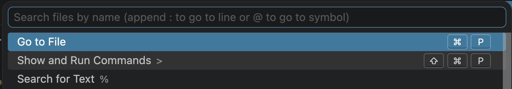
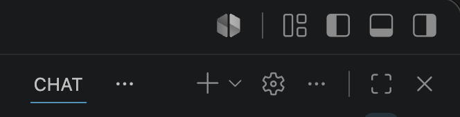
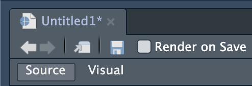

# Data Science Bootcamp 2026 (Part 2: Open Science)

- [Book](https://data-science-bootcamp-2026.github.io/bootcamp-open-science/) for detailed notes
    - Download PDF slides by clicking the easel icon on the top left
    - Download PDF version of the book by clicking the PDF document icon on the top left

---

**LEARNING OBJECTIVES:**

- [To be completed in workshop part 1]

---

**WORKSHOP PART 1:**

1. Go to the [book](https://data-science-bootcamp-2026.github.io/bootcamp-open-science/)
2. At the top left, click the GitHub icon (the cat)
3. Near the top right of the GitHub page, click **Fork**
4. Click the green **Create fork** button

You have now created a fork (a copy of a repository that you do not have write access to) on your own GitHub account. You *do* have write access to this forked copy. But this still only lives on the cloud. To download a linked copy locally, we need to clone it.

5. Click the green **<> Code** button
6. Copy the HTTPS URL
7. Open VS Code
8. Click the search bar

  

9. Click **Show and Run Commands >**
10. Click **Git: Clone** (if it does not show up, start typing it in to bring it up)
11. Paste the URL and hit Enter
12. Save it; as long as the repo uses relative paths, it generally does not matter where you save it

Let's try using GitHub Copilot to add learning objectives to this README file:

13. Open `README.md` in VS Code
14. On VS Code, open the right pane (if you do not see a right panel, click the button on the top right of VS Code and it will pop up)

  

15. In the tab called CHAT (GitHub Copilot), type in this prompt: "Add learning objectives to this file."
    - Can you spot how GitHub Copilot knows which file you're referring to?
    - Besides `README.md`, GitHub Copilot can 'see' the repo you have open (which also contains the contents of the book and slides), so it can figure out appropriate learning objectives.
16. Wait a moment as it thinks of what to do. It will make a suggestion and you can click the blue **Keep** button to accept it. Review and revise as necessary.
17. View your GitHub Copilot usage limits by clicking the icon on the bottom right of VS Code.

  

Let's try changing the license:

18. Go to [choosealicense.com](https://choosealicense.com/)
19. Search through a license that is not the MIT License (because I already have that)
20. Copy the text and paste it into the LICENSE file then save

You've now made several changes to the repo. Let's stage, commit, and push:

21. Go to **Source Control** tab (the third button) on the left sidebar (it should have a blue number '3' on it)
22. There should be 3 changes that can be staged
    - Click through each one and notice how GitHub displays line additions and subtractions
    - Is the file you ignored on this list? If so, you did something wrong!
23. Stage changes by hovering your pointer over the files and click the `+` symbol; let's stage all of them by hovering your pointer over the **Changes** row and click its `+` symbol
24. Commit changes by providing a brief commit message in the free text field and clicking the blue **Commit** button
25. Push changes by clicking the blue **Sync changes ↑** button

Note that this was a simplified version of what you should normally do. For simplicity, we skipped some steps like creating a branch (we were working on the `main` branch, which is not best practice). Now let's do it the proper way!

---

**WORKSHOP PART 2:**

Now `origin/main` (remote repo) is up to date. As it happens, `main` is also up to date, but that's only because we were working on `main` throughout -- we'll do things properly below. For now, let's update `main` as if there were changes.

1. On VS Code, go to the **Source Control** tab again
2. If `main` is outdated, it would normally show a blue **Sync changes ↓** button and clicking that would update your local `main`. In this case, there wouldn't be, but let's go through the motions anyway by manually pulling it:
    - Hover your pointer over the the **CHANGES** row
    - Click `...`
    - Click **Pull**

Create a branch:

3. Click the **main** on the bottom left of VS Code
4. A dropdown menu will appear from the search bar
5. Click **+ Create a new branch** (this will use your current branch, `main`, as the template) and give your new branch a name
    - Notice the branch name on the bottom left has changed

Let's make a Quarto document using RStudio:

6. Using what you learned in Part 1 of this bootcamp, create an R project for this repo
7. Follow the instructions on [this guide](https://quarto.org/docs/tools/rstudio.html) to create a Quarto document
    - The only thing I would change is, **in the first pop-up, uncheck "Use visual markdown editor"**
    - That option would open the Quarto document in a code-less (view) mode, but it can be more intuitive to work in the source (edit) mode
    - You can always switch between **Source** and **Visual** modes on the taskbar

  

8. Save this Quarto document in a new folder within the repo called `analysis`
9. Fill in the Quarto document, following appropriate syntax:

| What you want | Markdown syntax |
|---|---|
| Heading | `# Main heading`, `## Subheading` |
| Bold or italics | `**bold**`, `*italics*` |
| Bulleted list | `- Item` |
| Numbered list | `1. Item` |
| Link | `[Text](https://example.com)` |
| Image | `` |
| Inline code | `` `code` `` |
| Code block | Three backticks on the lines before and after the code |

Now let's record the R dependencies using `renv`:

10. In the R console, run `renv::init()` to initialize
    - If you do not have the `renv` package installed, run `install.packages("renv")` first
    - `renv::init()` creates several things in your repo; check them out:
        - `renv.lock`
        - `.Rprofile`
        - `renv/` folder
11. Try writing `library(tableone)` in an R chunk in your Quarto document and save
    - RStudio will warn you that you need `tableone` but don't have it installed
    - You may be surprised because we used `tableone` in Part 1 of the bootcamp, so why is it saying you don't have it?
    - `renv` creates a project-specific library; this repo is now separated from your default system library for R - this lets you freeze your package versions within this project so it doesn't break when the R and package versions move on outside it
12. Install `tableone`
13. Run `renv::status()` to view what needs updating in the snapshot
14. Run `renv::snapshot()` to update `renv.lock`
15. As a check to make sure everything is okay, try running `renv::restore()` to restore the packages; if everything had worked perfectly, there would not be anything new to restore

Now let's stage, commit, and push the changes.

16. Use the steps from earlier to stage and commit the changes
17. The push will be a bit different this time because we created a new branch -- and there is no remote version of this branch
    - So instead of a blue **Sync changes ↑** button, you will see a blue **Publish branch** button; click it
17. Go to GitHub and you should see a yellow banner
    - Click the green **Compare & pull request**
    - A pull request is a proposal to merge changes from one branch to another (in this case, from the new remote branch into the `main` remote branch)
18. Provide a pull request description
19. Click the green **Create pull request** button
20. GitHub will check for merge conflicts
21. Because this is your repo, it is your responsibility to look over the pull request and approve it
    - Click the green **Merge pull request** button
    - Click the green **Confirm merge** button
    - Click **Delete branch**
22. Go back to VS Code, switch to the `main` branch by clicking on the branch name on the bottom left, and pull the updates by clicking the blue **Sync changes ↓** button
    - If there's no **Sync changes ↓** button, manually pull the changes by hovering your pointer over the the **CHANGES** row and click its `...` symbol, then **Pull**

And so the cycle continues for future changes! Notice on the **Source Control** tab, under **GRAPH**, you can view a visual history of this repo.
