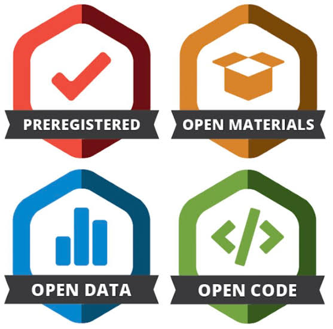

## What you will learn

By the end of this session, you should be able to:

- Explain how open science supports transparent and reproducible research
- Use Git, GitHub, and VS Code for version control
- Use Quarto for literate programming
- Use `renv` for dependency management in R


## Declaration of AI-assisted technologies

All instructional material in this presentation was written by the author. OpenAI Codex (GPT-5.6-Terra, reasoning: high) helped format the slide deck. The author reviewed, edited, and verified the suggestions as needed and takes full responsibility for the final product.


## Open science

::: {.compact}

+-------------------------------+-------------------------------------------------------------------------+
| Concept                       | Focus                                                                   |
+===============================+=========================================================================+
| **FAIR** [@wilkinson2016fair] | Research outputs are Findable, Accessible, Interoperable, and Reusable  |
+-------------------------------+-------------------------------------------------------------------------+
| **Transparency**              | Study decisions, definitions, and methods can be understood             |
+-------------------------------+-------------------------------------------------------------------------+
| **Reproducibility**           | The workflow can be verified                                            |
+-------------------------------+-------------------------------------------------------------------------+

:::

<hr>

::: {.columns}
::: {.column width="48%"}
:::{.fragment}
### Make research easier to find/use

- Metadata
- Documentation
- Licensing
- Archival
:::
:::

::: {.column width="48%"}
:::{.fragment}
### Make research easier to verify

- Protocol
- Reporting checklist
- Sharing data, code, and materials
- Version control
- Dependency management
:::
:::
:::

::: {.notes}
- Open science is a movement.
- It emphasizes transparency, equity, inclusivity, and sustainability -- it means everyone can participate and reap the benefits of science.
- To do that, we need to follow best practices and make research material available.
:::


## Open science across the research lifecycle

<br>

![Open science principles throughout the research process [@centerforopensciencewhat]](assets/images/lifecycle-practices.png){fig-alt="Open science practices across the research lifecycle" width="90%" fig-align="center"}

::: {.notes}
- We will focus only on open data, open code, and open materials.
:::


## Open pharmacoepidemiology

::: {.columns}
::: {.column width="48%"}
Tazare *et al.* 2024 [@tazare2024sharing]:

- Reviewed studies in *PDS* journal to see how frequently code was shared
- Increased from 2% in 2017 to 10% in 2022, but that is still low
- *Where* authors share code is important -- this figure shows most studies that shared code did so in supplementary material
:::

::: {.column width="48%"}
![Location of code, when shared [@tazare2024sharing]](assets/images/pds5856-fig-0001-m.png){fig-align="center" width="600px"}
:::
:::

::: {.notes}
Sharing via the supplement is difficult to discover, not indexed, and does not support complex filing structures [@weberpals2025lets].
:::


## Free and open source software (FOSS)

::: {.columns}
::: {.column width="48%"}
### Free software [@gnuproject2026what]

Focuses on the user's freedoms to use, study, modify, and distribute software.
:::

::: {.column width="48%"}
### Open source software [@opensourceinitiative2007open]

Focuses on the practical benefits: collaboration, quality, security, and innovation.
:::
:::

::: {.key-point}
FOSS combines these perspectives in a neutral way: source code is available under a **license** that permits use, study, modification, and distribution.
:::

::: {.notes}
- FOSS can be made by the community, volunteers, organizations, or even companies.
- You may wonder why companies release FOSS if it might benefit their competitors?
    - It increases adoption
    - It encourages ecosystem adoption
    - It opens a pathway for optional paid features (e.g., cloud services)
:::


## FOSS creates both [opportunity]{.green} and [dependency]{.red}

::: {.columns}
::: {.column width="47%"}
::: {.green}
{fig-alt="Open science badges" height="400px" fig-align="center"}
:::
:::

::: {.column width="47%"}
Even if you may not develop software, you still consume them:

- Learn best practices
- Access educational resources
- Join a diverse community
- Stay at the forefront of innovation (rather than the meta)
:::
:::

::: {.notes}
Ways you may be using FOSS already:
- R
- Tidyverse
- Table 1 generators
- Sample size calculators
:::


## FOSS creates both [opportunity]{.green} and [dependency]{.red}

::: {.columns}
::: {.column width="47%"}
::: {.red}
![Critical dependencies [@xkcddependency]](assets/images/dependency.png){fig-alt="Cartoon illustrating software dependency chains" height="400px" fig-align="center"}
:::
:::

::: {.column width="47%"}
- Widely used tools can become critical infrastructure
- A neglected or compromised dependency can affect many downstream projects
- Licenses determine how software can be reused and distributed
:::
:::

::: {.notes}
Example: XZ Utils backdoor incident
:::


## GitHub is for active work; repositories preserve snapshots

::: {.columns}
::: {.column width="48%"}
### GitHub

- Version control, especially for code
- Collaboration
- Sharing (such as these slides/book!)
- Active project development
:::

::: {.column width="48%"}
### OSF and Zenodo

- Assign persistent DOIs
- Support citation and discovery of research assets
- Long-term archival
:::
:::

::: {.columns}
::: {.column width="48%"}
{fig-alt="Github logo" width="10%"}
:::

::: {.column width="24%"}
{fig-alt="Open Science Framework logo" width="55%"}
:::

::: {.column width="24%"}
{fig-alt="Zenodo logo" width="55%"}
:::
:::


## Code editing: text files make change visible

::: {.columns}
::: {.column width="48%"}
### Text files

- Code: `.R`, `.py`
- Markup: `.md`, `.qmd`, `.html`
- Configuration: `.yaml`, `.json`
- Git can show line-by-line changes
:::

::: {.column width="48%"}
### Binary files

- Media, PDFs, and executables
- Require specific software to view
- Git can show that *something* in the file changed, but not point it out
:::
:::

::: {.key-point}
Text files are simple, readable, and portable -- well suited to version control!
:::

::: {.notes}
All files are technically binary in machine language, but it's useful to make a functional distinction for the humans reading them.
:::


## VS Code and RStudio serve different priorities

::: {.columns}
::: {.column width="48%"}
### VS Code

- Broad extension ecosystem
- Strong Git and GitHub integration
- Supports many languages and coding assistants
:::

::: {.column width="48%"}
### RStudio

- Polished interactive R workflow
- Console and Environment panes for exploration
- Familiar project-oriented interface
:::
:::

::: {.key-point}
Both can edit scripts, run code, use terminals, and work with Git. **You can have both open.** When you save a script on one, it will update on the other.
:::

::: {.notes}
Posit also made Positron, a fork of VS Code but adapted to the familiar RStudio panes.
:::


## Git records a project's history

::: {.columns}
::: {.column width="48%"}
Git is a **distributed** version control system, meaning each contributor has a local copy of the repository and its history. Instead of this:

```text
script.R
script_draft1.R
script_final.R
```

You track one file, `script.R`, but save a series of snapshots.
:::

::: {.column width="48%"}
![Distributed version control system [@weberpals2025lets]](assets/images/remote_local.png){fig-alt="Diagram showing local and remote repositories" width="88%"}
:::
:::

::: {.notes}
- Like Tracked Changes for Word, but for code.
- Imagine what would happen if two people edit the same line of code at the same time, but have different edits. That would break it! Having it distributed will isolate the working environment. If there are conflicts, then they will be explicit and resolved when merging into the "middle-man": the cloud.
:::


## Remote & local

::: {.columns}
::: {.column width="48%"}
- **Remote repo:** lives on the cloud
- **Local repo:** lives locally on each user's computer
- No autosync (by design)
- You *push* changes up to the cloud
- Others *pull* changes down from the cloud
:::

::: {.column width="48%"}
![Remote and local repositories [@weberpals2025lets]](assets/images/remote_local.png){fig-alt="Diagram showing local and remote repositories" width="88%"}
:::
:::


## Branches

- A **branch** is a parallel version of an existing branch
- The default branch on GitHub is called `main`
- The remote repo is denoted with prefix `origin/`, e.g., `origin/main`
- Protect the `main` branch; isolate work in separate branches

<div class="branch-animation" aria-label="A step-by-step animation of local and remote Git branches">
<div class="branch-reset fragment" data-fragment-index="4"></div>
<div class="branch-node remote at-main-remote"><span>Remote</span>origin/main</div>
<div class="branch-node local at-main-local"><span>Local</span>main</div>
<div class="branch-link down at-main-link"><span>pull</span></div>

<div class="branch-node local at-feature-local branch-addition fragment" data-fragment-index="1"><span>Local</span>my-branch</div>
<div class="branch-link right branch-addition fragment" data-fragment-index="1"><span>branch</span></div>

<div class="branch-node remote at-feature-remote branch-addition fragment" data-fragment-index="2"><span>Remote</span>origin/my-branch</div>
<div class="branch-link up at-feature-link branch-addition fragment" data-fragment-index="2"><span>push</span></div>

<div class="branch-link left branch-addition fragment" data-fragment-index="3"><span>merge<br>(pull request)</span></div>

<div class="branch-node local at-feature-local fragment" data-fragment-index="5"><span>Local</span>my-branch2</div>
<div class="branch-link right fragment" data-fragment-index="5"><span>next branch</span></div>
</div>


## Clone & fork

- It is easier to set up a repo remotely then copy it locally, than vice versa
- The first time you set up a project locally:
    - For external repos, first **fork** the repo to create a copy on your GitHub account
    - Then **clone** the repo to create a copy locally

<div class="branch-animation" aria-label="Project setup">
<div class="branch-node remote at-main-remote"><span>Remote</span>origin/main</div>
<div class="branch-node local at-main-local"><span>Local</span>main</div>
<div class="branch-link down at-main-link">
<span class="fragment fade-out" data-fragment-index="1">clone</span>
<span class="fragment" data-fragment-index="1">pull</span>
</div>
</div>

::: {.notes}
- You *do* have write access to the forked copy
:::


## Workflow

Making changes is a three-step process:

1. **Stage** select the changes for a snapshot
    - You do not need to select every saved change
2. **Commit** the snapshot with a brief commit message
    - These snapshots will form the history
3. **Push** commits to the remote repository

::: {.notes}
- Start with a private repo and only make public when finalized.
- Making a repo public will publish the entire history -- beware any protected data and credentials.
- Once data becomes public, it cannot be easily retracted, and someone/machine may have already saved a local copy.
:::


## Coding assistants can support development

::: {.columns}
::: {.column width="48%"}
- Explain unfamiliar code
- Summarize files and changes
- Test code
- Proofread
:::

::: {.column width="48%"}
- Suggest optimization (efficiency)
- Suggest refactoring (readability, maintainability)
- Add documentation
:::
:::

::: {.key-point}
Treat generated suggestions as drafts: review them, test them, and remain responsible for the final work.
:::


## Revised repository structure

::: {.columns}
::: {.column width="68%"}
- Separate code, data, documentation, and outputs
- Use relative paths
- `.gitignore` leaves out unnecessary or sensitive information from being committed
- `LICENSE` specifies how people can use your work (choose one [here](https://choosealicense.com/))
- `README.md` helps people understand and use your repo; it is displayed on the landing page on GitHub
:::

::: {.column width="30%"}
<br>

```text
.
├── analysis/
├── data/
├── docs/
├── output/
├── src/
├── .gitignore   # NEW
├── LICENSE      # NEW
└── README.md    # NEW
```
:::
:::

::: {.notes}
- Making your repo public only lets others view and fork
- Without a license, you retain all rights ("all rights reserved"), preventing reuse
- Licenses tell others how they can use, modify, and share your code
- So what is this `.md` file type? (see next slide)
:::


## Markup makes plain text publishable

**Markup** is plain text with syntax that describes how to structure and render it:

::: {.compact}

+---------------------+-------------------------------+
| Syntax              | Markdown                      |
+=====================+===============================+
| Heading, subheading | `# Heading 1`, `## Heading 2` |
+---------------------+-------------------------------+
| Bold, italics       | `**bold**`, `*italics*`       |
+---------------------+-------------------------------+
| List                | `- Item` or `1. Item`         |
+---------------------+-------------------------------+
| Link                | `[Text](https://example.com)` |
+---------------------+-------------------------------+
| Image               | ``       |
+---------------------+-------------------------------+
| Inline code         | `` `code` ``                  |
+---------------------+-------------------------------+

:::

::: {.key-point}
**Markdown** (`.md`) is a very common markup language because it is simple. As a text file, it is easy to read (even before rendering), edit, share, and track with Git.
:::


## Quarto combines text, code, and results

**Literate programming** interweaves human-readable documentation with source code and output [@knuth1984literate]:

- E.g., these bootcamp slides and books
- E.g., this [manuscript](https://mine-cetinkaya-rundel.github.io/indo-rct/) -- if it asks you to sign in, just click cancel and it will work

::: {.key-point}
Quarto is a publishing system that turns your code (`.md`, `.R`, and many other languages) into HTML, PDF, Word, slides, and other rendered formats
:::

::: {.notes}
- Quarto extends R markdown by supporting many programming languages
- A version of Quarto is bundled with RStudio
:::


## Quarto components

::: {.columns}
::: {.column width="30%"}
### YAML header

```yaml
---
title: "My study"
author: "Your Name"
date: last-modified
toc: true
format: html
---
```
:::

::: {.column width="30%"}
### Plain text

```text
You can write normal text
here in Markdown syntax.
```
:::

::: {.column width="30%"}
### Executable chunks

````{.markdown}
```r
library(readr)
df <- read_csv("data.csv")
```
````
:::
:::

<br>

::: {.key-point}
The richest Quarto output is HTML, allowing interactable features like tabsets, show/hide code chunks, etc.
:::


## Quarto supports various languages

::: {.columns}
::: {.column width="48%"}
- Code can be shown, hidden, or folded depending on the audience
- R, Python, and even SAS and Stata (these require additional setup) can be executed in the same publication
:::

::: {.column width="48%"}
- Here is an equation written in LaTeX syntax, rendering beautifully:

```text
$$
Y = \beta_0 + \beta_1 X_1 + \dots + \beta_p X_p
$$
```

$$
Y = \beta_0 + \beta_1 X_1 + \dots + \beta_p X_p
$$
:::
:::

::: {.key-point}
You can also add figures, tables, and references.
:::


## `renv` manages R dependencies

::: {.columns}
::: {.column width="33%"}
### Starting

```r
renv::init()
```

Creates `.Rprofile`, `renv.lock`, and project library (package will be installed here instead of your default library).
:::

::: {.column width="33%"}
### Sharing

```r
renv::snapshot()
```

Records the current R and package versions into a recipe.
:::

::: {.column width="33%"}
### Restoring

```r
renv::restore()
```

Restores the package versions based on the recipe.
:::
:::

::: {.fragment}
::: {.key-point}
`renv` tracks and records your R version, but **it does not install or switch your R version**, which may break your code too. To switch between different versions of R, see the [Bootcamp Prep book](https://data-science-bootcamp-2026.github.io/bootcamp-prep/03_update_software.html).
:::
:::


## Key takeaways

1. **Open science** is a movement that includes transparency and reproducibility.
2. **FOSS** enables collaboration but introduces dependencies and licensing responsibilities.
3. Use **Git** for version history, collaboration, and sharing.
4. Use **Quarto** to turn plain text, code, and results into reproducible documents.
5. Use `renv` for dependency management in R.


## Further readings

- HARPER template for pharmacoepidemiology protocols [@wang2023harmonized]
- Open Source Guides [@github2026open]
- Reproducible analytic workflows using Git and R [@weberpals2024fairification]
- Quarto in RStudio [@positrstudioa]


## References {#refs}

<script>
window.addEventListener("load", function () {
  function fitReferenceList() {
    const isPrintView = window.location.search.includes("print-pdf");
    const slide = isPrintView
      ? document.getElementById("refs")
      : Reveal.getCurrentSlide();
    if (!slide || slide.id !== "refs") return;

    const references = slide.querySelector(":scope > .references");
    if (!references) return;

    references.style.fontSize = "";
    const maximum = parseFloat(window.getComputedStyle(references).fontSize);
    const minimum = 10;
    const slideBox = slide.getBoundingClientRect();
    const referencesBox = references.getBoundingClientRect();
    const availableHeight = slideBox.bottom - referencesBox.top - 8;

    if (referencesBox.height <= availableHeight) return;

    let lower = minimum;
    let upper = maximum;
    for (let iteration = 0; iteration < 12; iteration += 1) {
      const size = (lower + upper) / 2;
      references.style.fontSize = `${size}px`;
      if (references.getBoundingClientRect().height <= availableHeight) {
        lower = size;
      } else {
        upper = size;
      }
    }
    references.style.fontSize = `${lower}px`;
  }

  fitReferenceList();
  Reveal.on("ready", fitReferenceList);
  Reveal.on("slidechanged", function (event) {
    if (event.currentSlide.id === "refs") {
      window.requestAnimationFrame(fitReferenceList);
    }
  });
  window.addEventListener("resize", function () {
    window.requestAnimationFrame(fitReferenceList);
  });
});
</script>
